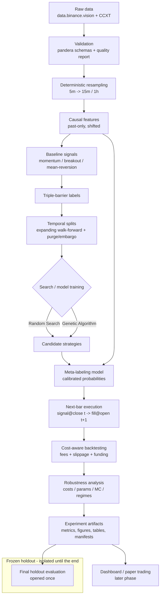

# System Architecture — v0.1

The project is a **modular monolith**: all core logic lives in importable,
tested Python modules under `src/perp_lab/`. Notebooks are a *presentation and
experimentation* layer only — they load configuration, call library functions
and narrate results. No core logic lives solely in a notebook.

This document describes the **intended end-to-end pipeline** and the
responsibility of each module. Modules already implemented (Phase 1 / EDA) are
marked ✅; modules specified for Chapter 5 but not yet implemented are marked 🟡.

> **The 🟡 markers below are out of date.** A repository audit on 2026-08-08
> established that `features/`, `strategies/`, `backtesting/`, walk-forward
> validation, `search/`, `evaluation/` and `tracking/` are implemented and tested.
> Only `labeling/` and `models/` remain unimplemented. For the audited status of
> every module, and for the boundaries of the layers that do not yet exist, see
> [`docs/roadmap/current_state.md`](roadmap/current_state.md) and
> [`docs/roadmap/future_architecture.md`](roadmap/future_architecture.md).

## Pipeline overview

Left-to-right, information only ever flows forward in time; the frozen holdout
is isolated from every development, selection and tuning step and is opened once
for `N`.

## Module responsibilities (`src/perp_lab/`)

| Module | Status | Public responsibility |
|--------|--------|-----------------------|
| `config/` | ✅ | Pydantic models + loaders for the data contract, EDA config and operational settings (seed, paths). Chapter 5 adds an `ExperimentConfig` model for `configs/experiment.yaml`. |
| `data/` | ✅ | Providers (`binance_vision`, `ccxt_incremental`), bulk download, deterministic bar construction (`bars.py`), manifests (`manifest.py`), chronological splits + holdout (`splits.py`). |
| `validation/` | ✅ | `pandera` schemas and the data-quality report (gaps, duplicates, OHLC consistency, extreme flags, coverage). |
| `eda/` | ✅ | Reusable EDA statistics and plotting (returns, volatility, tail risk, dependence, seasonality, funding, order flow, descriptive regimes, events). Descriptive only. |
| `reporting/` | ✅ | House style + artifact system (`save_figure`, `save_table`) writing figures/tables with reproducibility metadata. |
| `utils/` | ✅ | Time handling (UTC, timeframe math), hashing (SHA-256), logging, seeding. |
| `features/` | 🟡 | **Causal feature engine.** Build past-only, explicitly shifted feature frames from validated bars + aux streams. Enforces availability timestamps and leakage checks. See `methodology/feature_catalogue.md`. |
| `strategies/` | 🟡 | **Strategy representation + baselines.** Encode momentum/breakout/mean-reversion as parameterised rule objects producing entry/exit/direction signals; shared parameter space for RS and GA. |
| `labeling/` | 🟡 | **Triple-barrier + meta-labeling targets.** Compute upper/lower/vertical barrier outcomes and event-level meta-labels (trade profitable after costs?). |
| `backtesting/` | 🟡 | **Cost-aware, next-bar backtester.** Fees, slippage, funding, position sizing, leverage/exposure limits, missing-price handling; produces trade and equity series and metrics. |
| `validation/` (walk-forward) | 🟡 | **Temporal validation.** Expanding walk-forward fold generator with purging and embargo derived from the max label horizon / holding period. (May live in `validation/` or a new `splits`/`cv` submodule.) |
| `search/` | 🟡 | **Strategy discovery.** Random Search and Genetic Algorithm over the shared space with a common evaluation harness and equal budget. |
| `models/` | 🟡 | **Meta-labeling models.** Logistic Regression, Random Forest, LightGBM with probability calibration and validation-only threshold tuning. |
| `evaluation/` | 🟡 | **Metrics + robustness.** Performance metrics, per-asset/fold/regime breakdowns, robustness battery, deflated Sharpe, benchmark comparison. |
| `tracking/` | 🟡 | **Experiment tracking.** Run configuration, seeds, dataset manifest hashes and result artifacts recorded reproducibly (lightweight now; MLflow in a later phase). |

## Reproducibility

- **Configuration-driven:** all knobs live in `configs/*.yaml`; code reads
  validated Pydantic models, no magic constants.
- **Determinism:** one global seed (42) → Python / NumPy / `PYTHONHASHSEED`;
  every stochastic component (RS sampler, GA operators, model training,
  bootstrap) derives a child seed from it.
- **Provenance:** every experiment records the dataset manifest IDs + SHA-256,
  the resolved config, the code commit, and output artifact paths.
- **Quality gate:** `ruff`, `ruff format --check`, `pyright`,
  `pytest -m "not network"` must stay green as modules are added.

## Notebook boundary

Notebooks (e.g. the completed EDA notebook, and future Chapter 5 experiment
notebooks) must: load config, call `perp_lab` functions, arrange results, and
narrate. They must **not** contain reusable statistical, backtesting or search
logic, hidden state, or execution-order dependencies, and must run top-to-bottom
from a clean kernel.
