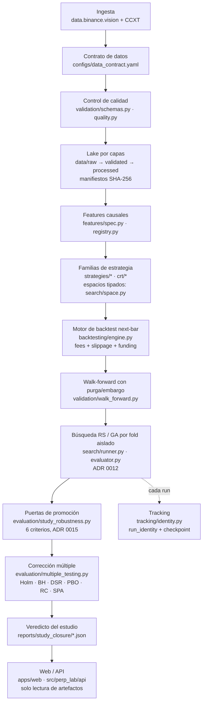
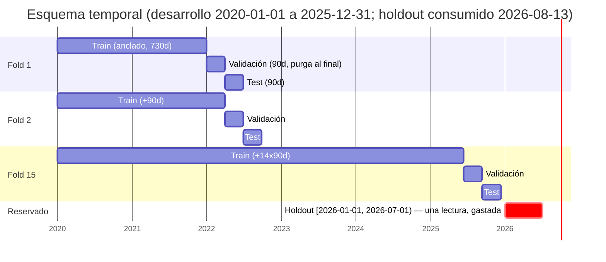

# El pipeline de punta a punta

Fecha: 2026-08-19. Documenta el pipeline **tal como está construido**, con la
ruta de código de cada etapa, sus entradas y salidas, la decisión de diseño que
lo gobierna y la alternativa que un tribunal preguntaría.

## Diagrama general

## Diagrama temporal: folds y holdout

Los quince folds de test son contiguos y sin solape (step = test = 90 días); el
embargo se descuenta del final del train y la purga del final de la validación
(`validation/walk_forward.py`, derivados de `label_horizon`/`max_holding`, nunca
elegidos a ojo).

## Etapas

### 1. Ingesta
- **Qué hace:** descarga masiva de klines 5m desde `data.binance.vision` con
  verificación de checksum, incrementales por CCXT; funding y mark price.
- **Código:** `src/perp_lab/data/` (providers, manifest).
- **Entra/sale:** exchange → `data/raw/` inmutable + manifiesto SHA-256 por
  dataset (`data/manifests/*.json`).
- **Decisión:** 5m como base única; 15m y 1h se **construyen** por resampleo
  determinista, no se descargan (`configs/data_contract.yaml:15-18`).
- **Pregunta de tribunal:** ¿por qué no descargar 1h nativo? — Porque un único
  origen resampleado elimina la posibilidad de inconsistencias entre
  temporalidades; el cruce contra klines nativos existe como test de red.

### 2. Contrato de datos
- **Qué hace:** fija símbolos, temporalidades, cutoff (`2026-07-01` exclusivo) y
  la ventana reservada, como dato versionado.
- **Código:** `configs/data_contract.yaml`, `src/perp_lab/config/models.py`,
  `data/splits.py:29` (`resolve_holdout_start`).
- **Decisión:** el holdout se fija por fecha explícita, no por «últimos N
  meses», para que la frontera sea exacta (ADR 0003).

### 3. Control de calidad
- **Qué hace:** validación estructural (Pandera, `strict=True`) y reporte de
  calidad: huecos, duplicados, monotonicidad, violaciones OHLC, retornos
  extremos **marcados y nunca borrados**.
- **Código:** `validation/schemas.py`, `validation/quality.py`.
- **Decisión:** reportar en vez de mutar. La alternativa (limpiar
  automáticamente) decide silenciosamente qué es un error de feed y qué es un
  evento real; aquí esa decisión queda documentada en el EDA.

### 4. Features causales
- **Qué hace:** cada feature declara entradas, ventana, warm-up y el instante en
  que su valor es conocible; el frame se construye una vez sobre desarrollo.
- **Código:** `features/spec.py`, `features/registry.py`, `features/causal.py`.
- **Decisión:** causalidad verificada por test sobre datos reales (invariancia
  de prefijo: truncar el futuro no cambia el pasado) más un contraejemplo con
  fuga plantada que debe fallar.
- **Pregunta de tribunal:** ¿cómo sé que no hay look-ahead? — No por revisión de
  código sino por propiedad ejecutable: 7 tests de causalidad +
  `reports/figures/features/g04_leakage_counterexample.png`.

### 5. Familias de estrategia
- **Qué hace:** 13 familias interpretables (R2/R3) + 9 CRT, cada una con espacio
  tipado (`IntParam`/`FloatParam`/`CategoricalParam`/`BoolParam`), reparación,
  validación y hash canónico de candidato.
- **Código:** `strategies/*`, `crt/strategies.py`, `search/space.py`,
  `search/registry.py`.
- **Decisión:** el espacio se declara antes de buscar y no se amplía después
  (regla del proyecto); la cardinalidad finita se enumera
  (`space.finite_cardinality`, ADR 0014) para saber qué fracción cubre el
  presupuesto.

### 6. Motor de backtest
- **Qué hace:** semántica next-bar: señal al cierre de la barra *t*, ejecución
  en el open de *t+1*, retorno open-to-open; comisión y slippage por lado; giro
  largo→corto cobra dos unidades de nocional; funding realizado alineado
  `as_of_past`.
- **Código:** `backtesting/engine.py` (ledger por barra), `backtesting/metrics.py`.
- **Costes:** taker 4 bps + slippage 1 bps por lado (provisionales, ADR 0005),
  barrido de robustez [0,1,2,5] bps (`configs/experiment.yaml:156-167`).
- **Decisión:** si el experimento exige funding y no hay serie, el motor **falla**
  en vez de suponer cero.
- **Pregunta de tribunal:** ¿por qué no ejecutar al cierre de la señal? — Porque
  ese precio ya no existe cuando la señal se conoce; next-open es el primer
  precio alcanzable sin clarividencia.

### 7. Validación temporal
- **Qué hace:** walk-forward expandido anclado: 730 días iniciales de train,
  90/90/90 de validación/test/paso (`configs/experiment.yaml:133-139`); 15 folds
  en el histórico real; purga y embargo derivados.
- **Código:** `validation/walk_forward.py`;
  `assert_folds_exclude_holdout` lanza excepción, no aviso.

### 8. Búsqueda
- **Qué hace:** Random Search y Algoritmo Genético sobre el mismo espacio, mismo
  evaluador, mismo objetivo y **mismo presupuesto de evaluaciones únicas** (100
  por fold y motor en las rondas cerradas); la búsqueda corre **independiente
  dentro de cada fold** — un evaluador por fold, físicamente incapaz de ver
  otros (ADR 0012, `search/evaluator.py::single_fold_bundle`).
- **Selección:** fitness solo sobre validación; el ganador se congela con
  huella y se puntúa una única vez sobre el test de su fold.
- **Pregunta de tribunal:** ¿por qué el GA no descubrió nada mejor que RS? — Es
  un resultado del estudio, no un fallo: a presupuesto igual, el IC pareado de
  la diferencia incluye cero en casi todas las familias (y donde no, favorece a
  RS: `pdh_reclaim_short`, IC [−0.345, −0.007]).

### 9. Puertas de promoción
- **Qué hace:** 6 criterios simultáneos en ambos activos, mayoría 6/10 semillas
  por criterio (positividad, IC bootstrap del Sharpe excluye 0, sobrevive
  costes ×2, bate buy-and-hold, sobrevive sin las 5 mejores operaciones, no
  confinado a un fold), más vetos.
- **Código:** `evaluation/study_robustness.py`;
  contrato en `docs/roadmap/phase_gates.md`, veredicto en ADR 0015.

### 10. Corrección por contraste múltiple
- **Qué hace:** a nivel de estudio: Holm-Bonferroni y Benjamini-Hochberg sobre
  los p bootstrap por familia; Deflated Sharpe (Bailey & López de Prado 2014);
  PBO por CSCV (López de Prado & Zhu 2017); Reality Check (White 2000) y SPA
  (Hansen 2005) sobre bootstrap estacionario (Politis & Romano 1994); y una
  sensibilidad del recuento de pruebas bajo cuatro denominadores
  (13 → 22 → 142 → 496.500).
- **Código:** `evaluation/multiple_testing.py` (582 líneas, con las citas en el
  módulo); salida canónica
  `reports/study_closure/study_level_multiple_testing.json`.

### 11. Veredicto y registro
- **Qué hace:** cierre `CLOSED_NEGATIVE`: 0/13 promovidas, p mínimo 0.3455, PBO
  0.486, DSR de la mejor 0.139 con probabilidad 0.861 de ser espuria bajo N=13
  (0.9999 bajo N=496.500).
- **Tracking:** cada run lleva `run_identity` (config + contrato + hashes de
  datos + commit + diff), checkpoint reanudable y ledger de candidatos en
  Parquet (`tracking/identity.py`, `experiments/multi_seed.py`).
- **Consumo:** la web lee artefactos exportados (`public/data/*.json`), nunca
  ejecuta investigación.
