# Diagramas Mermaid — Capítulo 4

## Arquitectura del sistema de investigación y MLOps científico

Este documento propone una serie coherente de figuras para el capítulo 4. La
selección principal contiene siete figuras, suficientes para el cuerpo de la
tesis. Los diez diagramas complementarios permiten ampliar cada sección o
documentar detalles técnicos en un anexo.

Principios editoriales:

- representar contratos y responsabilidades, no cifras que envejecen;
- separar cálculo científico, custodia de evidencia y presentación;
- distinguir el identificador de un run de su identidad experimental;
- mostrar explícitamente la causalidad temporal y el aislamiento por fold;
- describir el catálogo como índice, no como fuente primaria de evidencia;
- denominar el holdout como partición originalmente reservada y posteriormente
  consumida, no como holdout todavía intacto;
- diferenciar la consulta web de solo lectura del laboratorio educativo en
  TypeScript.

---

## 4.1 Arquitectura y principios de diseño

### Figura 4.1 — Arquitectura lógica por planos [principal]

**Finalidad.** Presentar el sistema completo sin mezclar procesamiento,
experimentación, custodia de evidencia y consumo.

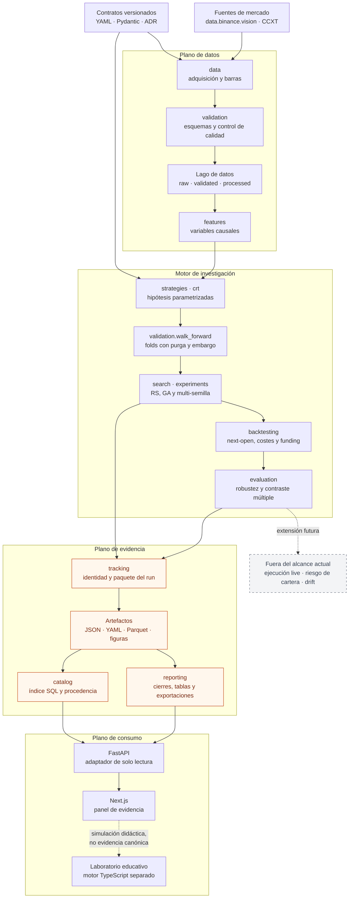

**Pie sugerido.** Arquitectura lógica del monolito modular. El flujo científico
transforma contratos y datos en evidencia persistida; las interfaces consultan
esa evidencia sin intervenir en la selección de estrategias.

**Evidencia:** `src/perp_lab/`, `docs/methodology/pipeline_end_to_end.md`,
`docs/platform/README.md`.

### Figura 4.1A — Fronteras del monolito modular [complementaria]

**Finalidad.** Justificar por qué CLI, notebooks y web no son la ubicación de la
lógica científica canónica.

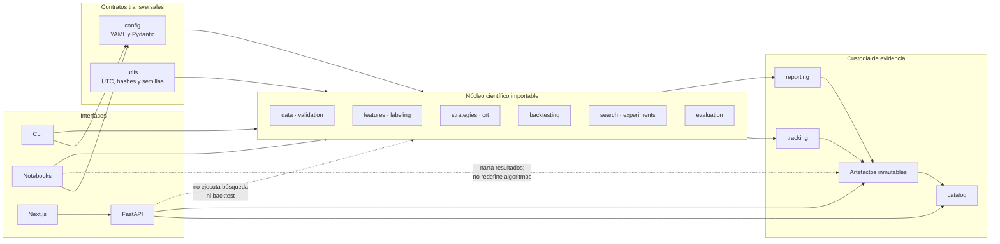

**Pie sugerido.** Fronteras de responsabilidad. Las interfaces orquestan o
presentan; la lógica reutilizable permanece en módulos Python testeables.

### Figura 4.1B — Ciclo de vida de la configuración [complementaria]

**Finalidad.** Mostrar que el contrato ejecutado es la configuración resuelta,
no una llamada abreviada ni valores dispersos en código.

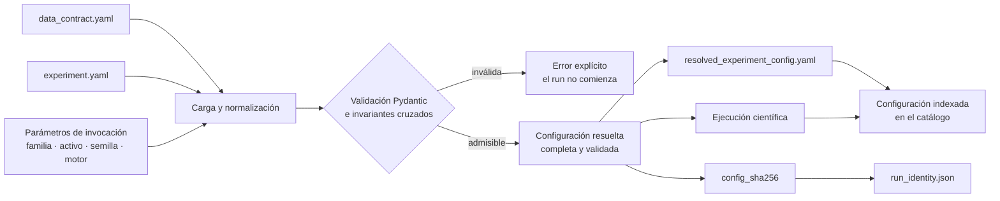

**Pie sugerido.** Ciclo config-as-code. La configuración se valida antes de
ejecutar y su forma resuelta queda incorporada a la evidencia del experimento.

---

## 4.2 Linaje, almacenamiento y calidad del dato

### Figura 4.2 — Linaje reproducible e integridad [principal]

**Finalidad.** Sustituir los diagramas separados de DAG y layout por una sola
figura que conecte transformación, particionado y manifiestos.

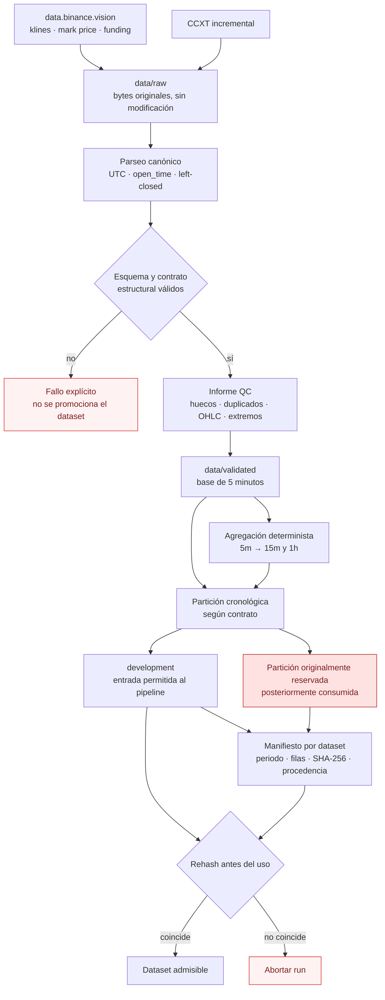

**Pie sugerido.** Linaje reproducible de los datos. Las transformaciones parten
de archivos originales inmutables y cada salida se vincula a un manifiesto cuyo
digest se vuelve a comprobar antes de utilizarla.

**Evidencia:** `configs/data_contract.yaml`, `src/perp_lab/data/`,
`src/perp_lab/validation/`, `data/manifests/`.

### Figura 4.2A — Política de control de calidad [complementaria]

**Finalidad.** Distinguir errores estructurales que bloquean el pipeline de
anomalías que se conservan y documentan.

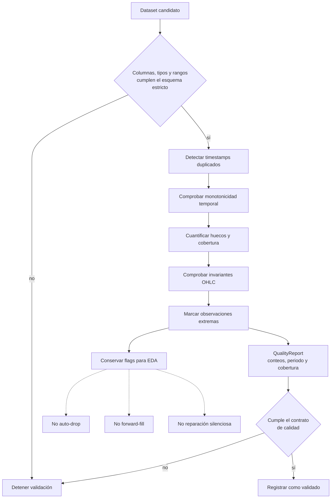

**Pie sugerido.** Política de control de calidad. Los errores de contrato
bloquean la promoción del dataset; las observaciones extremas se marcan y
conservan para no confundir eventos reales con errores de alimentación.

### Figura 4.2B — Modelo de almacenamiento científico [complementaria]

**Finalidad.** Explicar por qué conviven filesystem, Parquet, SQL y un backend
opcional de objetos.

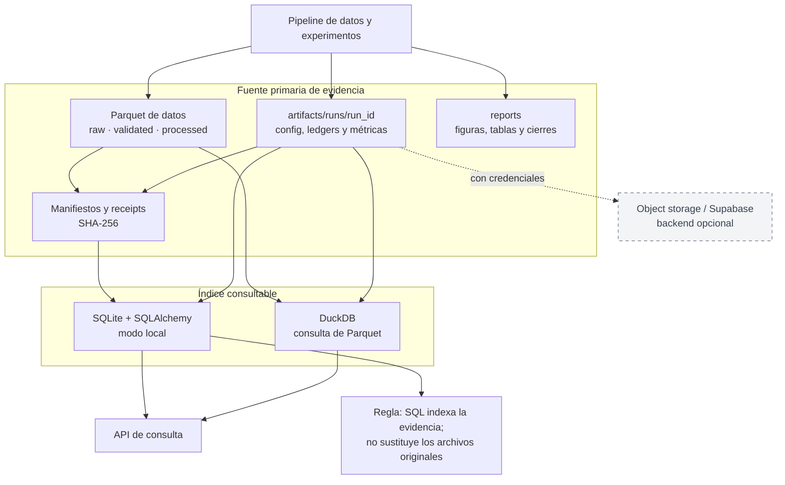

**Pie sugerido.** Persistencia híbrida. Los archivos constituyen la evidencia
primaria; SQL mantiene metadatos consultables y DuckDB analiza los artefactos
Parquet sin duplicarlos.

---

## 4.3 Contrato temporal, validación y ejecución

### Figura 4.3 — Contrato temporal causal [principal]

**Finalidad.** Corregir la figura actual: una señal calculada al cierre de la
barra `t` se aplica desde la apertura de `t+1`, no desde `t+2`.

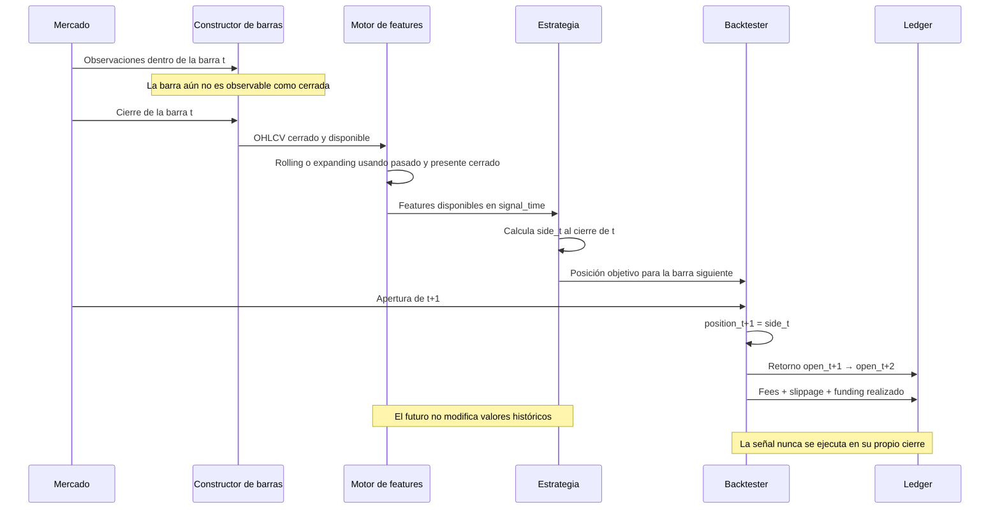

**Pie sugerido.** Contrato temporal de agregación, decisión y ejecución. Una
barra solo se utiliza después de cerrarse; la posición resultante comienza en la
apertura inmediatamente posterior y obtiene el retorno open-to-open.

**Evidencia:** `src/perp_lab/data/bars.py`,
`src/perp_lab/features/causal.py`,
`src/perp_lab/backtesting/engine.py`.

### Figura 4.3A — Aislamiento walk-forward por fold [complementaria]

**Finalidad.** Mostrar dónde actúan purga, embargo, selección y test sin sugerir
retroalimentación entre folds.

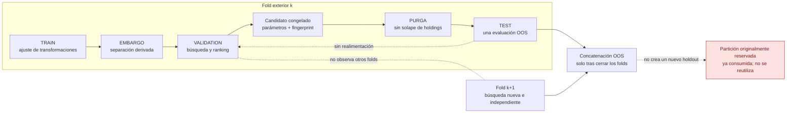

**Pie sugerido.** Validación walk-forward expandida. La búsqueda se repite de
forma independiente en cada fold, el candidato se congela antes del test y los
segmentos OOS solo se agregan después de cerrar la selección.

### Figura 4.3B — Contabilidad del backtest [complementaria]

**Finalidad.** Hacer auditable la formación del retorno neto y del ledger.

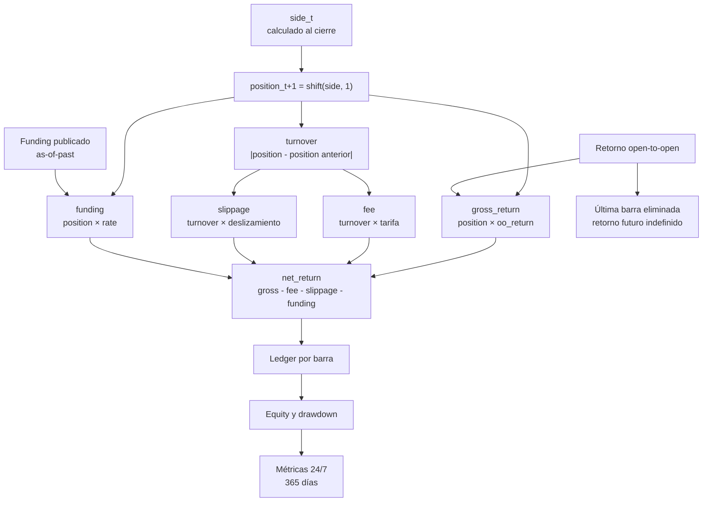

**Pie sugerido.** Contabilidad del motor cost-aware. El ledger conserva por
separado retorno bruto, rotación, costes, funding y retorno neto, permitiendo
repricing y auditoría posterior.

---

## 4.4 Orquestación experimental reproducible

### Figura 4.4 — Búsqueda aislada y captura de evidencia [principal]

**Finalidad.** Integrar configuración, paridad RS/GA, selección, test y escritura
del paquete del run.

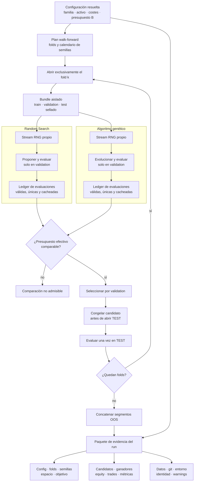

**Pie sugerido.** Orquestación aislada por fold. Ambos motores comparten espacio,
objetivo y presupuesto efectivo; la selección utiliza únicamente validación y
el test se consulta una vez después de congelar el candidato.

**Evidencia:** `src/perp_lab/search/runner.py`,
`src/perp_lab/search/evaluator.py`, `src/perp_lab/experiments/`,
`src/perp_lab/tracking/`.

### Figura 4.4A — Derivación determinista de semillas [complementaria]

**Finalidad.** Explicar independencia y reconstrucción de los flujos aleatorios
sin fijar valores numéricos que pertenezcan a un run concreto.

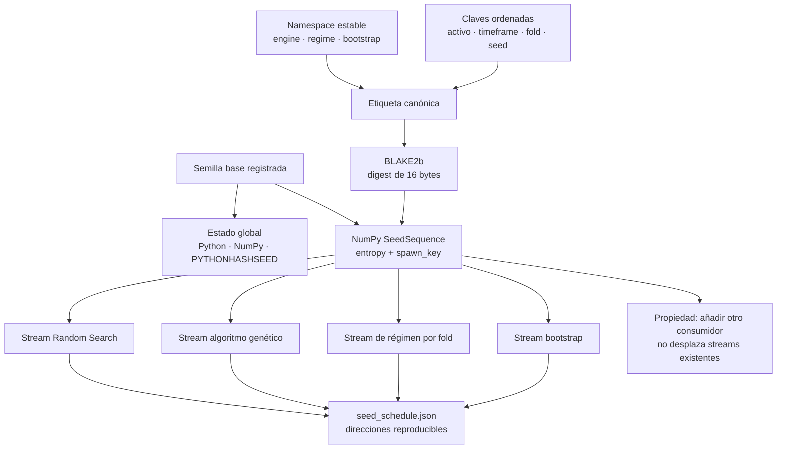

**Pie sugerido.** Árbol lógico de semillas. Cada stream queda direccionado por
una etiqueta estable y puede reconstruirse desde la semilla base sin acoplar
componentes independientes.

---

## 4.5 Identidad, catálogo y custodia de evidencia

### Figura 4.5 — Cadena de identidad y trazabilidad [principal]

**Finalidad.** Separar la dirección física del run de la identidad científica
del experimento.

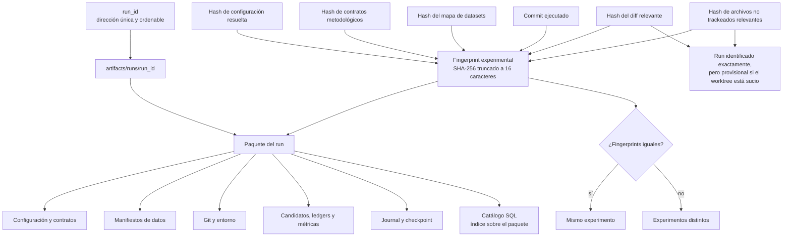

**Pie sugerido.** Cadena de identidad experimental. El `run_id` localiza una
ejecución, mientras que el fingerprint resume configuración, contratos, datos y
estado relevante del código; el catálogo indexa el paquete sin reemplazarlo.

**Evidencia:** `src/perp_lab/tracking/identity.py`,
`src/perp_lab/tracking/run.py`, `docs/decisions/0018-identity-diff-scoped-to-relevant-dirs.md`.

### Figura 4.5A — Modelo relacional del catálogo [complementaria]

**Finalidad.** Sustituir el ERD actual, cuyas relaciones no coinciden con las
claves foráneas de `catalog/models.py`.

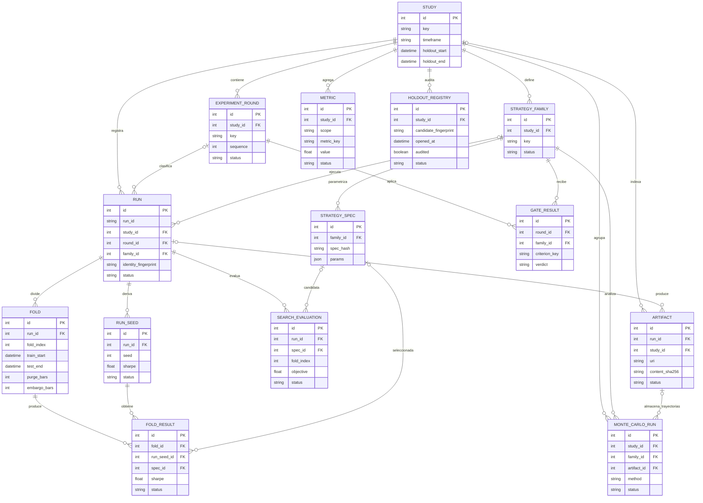

**Pie sugerido.** Catálogo científico. Las tablas normalizan estudios, runs,
folds, métricas y procedencia; los resultados masivos permanecen en artefactos
externos identificados por URI y digest.

---

## 4.6 Gobernanza y quality gates

### Figura 4.6 — Puertas de calidad científica [principal]

**Finalidad.** Representar por separado la CI obligatoria y las comprobaciones
locales que dependen del lago de datos o de otros entornos.

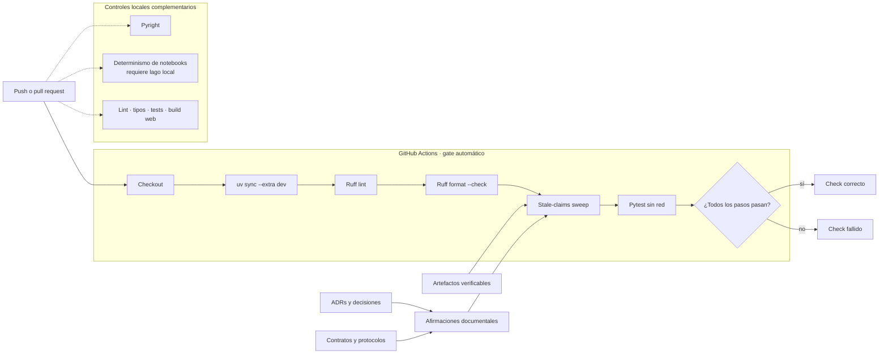

**Pie sugerido.** Puertas de calidad del repositorio. La CI verifica entorno,
estilo, tests y coherencia entre afirmaciones y evidencia; otros controles
permanecen locales por sus dependencias operativas.

**Evidencia:** `.github/workflows/ci.yml`,
`scripts/check_stale_claims.py`, `scripts/verify_determinism.py`,
`apps/web/package.json`.

### Figura 4.6A — Ciclo de gobernanza de una afirmación [complementaria]

**Finalidad.** Explicar qué aporta el término “MLOps científico” más allá de
automatizar tests.

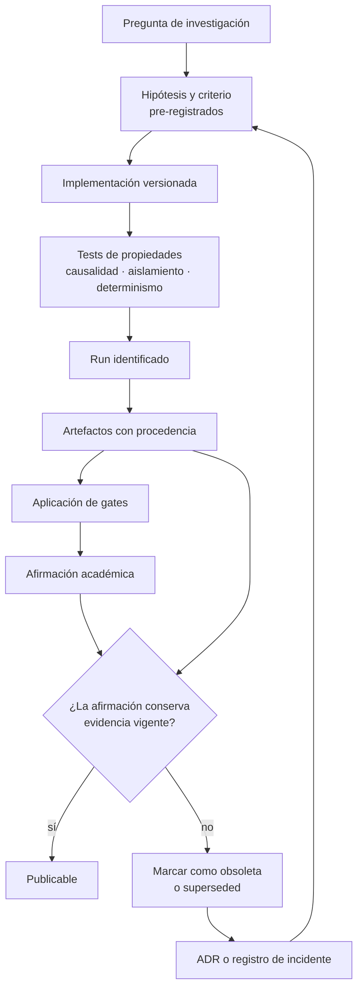

**Pie sugerido.** Ciclo de gobernanza científica. Una conclusión solo es
publicable si puede rastrearse hasta un protocolo, una implementación testeada y
artefactos vigentes; los resultados invalidados se conservan como evidencia
superseded.

---

## 4.7 Consulta y comunicación de evidencia

### Figura 4.7 — Serving de solo lectura [principal]

**Finalidad.** Mostrar cómo se publica la evidencia sin permitir que la capa web
modifique el proceso experimental.

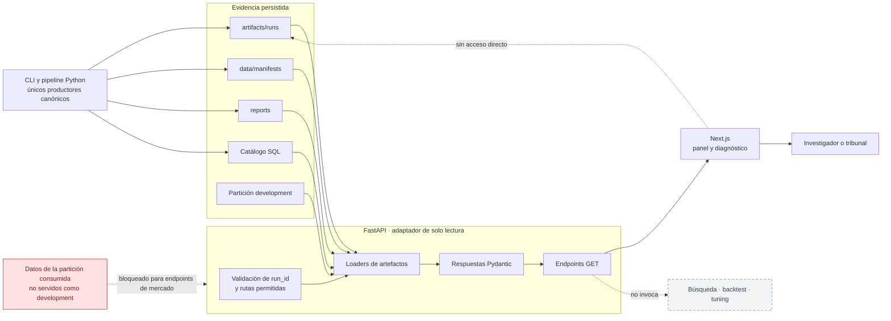

**Pie sugerido.** Arquitectura de consulta. FastAPI adapta artefactos existentes
a modelos tipados y Next.js los presenta; ninguna de estas capas ejecuta la
búsqueda canónica ni modifica los runs.

**Evidencia:** `src/perp_lab/api/`, `apps/web/`,
`docs/platform/README.md`.

### Figura 4.7A — Portal de evidencia frente a laboratorio educativo [complementaria]

**Finalidad.** Resolver la aparente contradicción entre una plataforma de solo
lectura y la existencia de un motor TypeScript en el navegador.

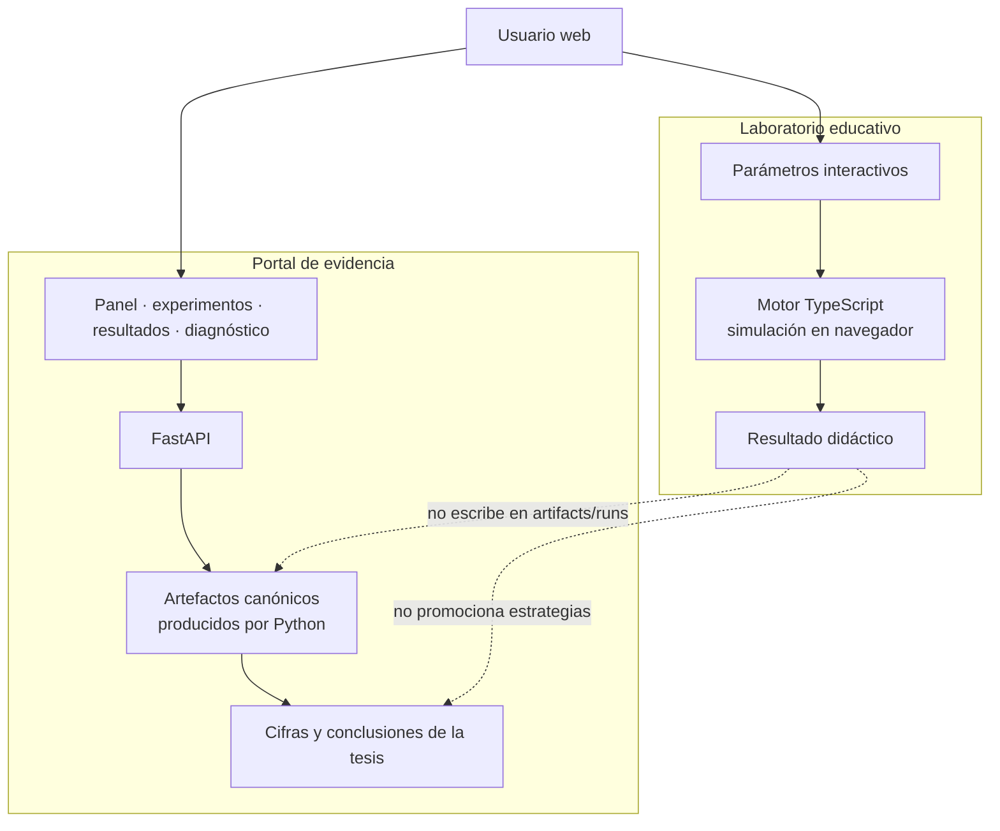

**Pie sugerido.** Separación entre comunicación y experimentación didáctica. El
portal presenta la evidencia canónica de Python; el laboratorio interactivo
explica mecanismos, pero sus simulaciones no sustentan conclusiones de la tesis.

---

## Selección editorial recomendada

Para el cuerpo principal:

1. Figura 4.1 — arquitectura lógica por planos.
2. Figura 4.2 — linaje reproducible e integridad.
3. Figura 4.3 — contrato temporal causal.
4. Figura 4.4 — búsqueda aislada y captura de evidencia.
5. Figura 4.5 — identidad y trazabilidad.
6. Figura 4.6 — quality gates científicos.
7. Figura 4.7 — serving de solo lectura.

Para subsecciones técnicas o anexo:

- 4.1A fronteras modulares;
- 4.1B configuración como código;
- 4.2A política QC;
- 4.2B persistencia híbrida;
- 4.3A walk-forward;
- 4.3B contabilidad del backtest;
- 4.4A árbol de semillas;
- 4.5A ERD del catálogo;
- 4.6A ciclo de gobernanza;
- 4.7A portal frente a laboratorio educativo.

La captura `fig_4_11_dashboard_es.png` puede conservarse como ilustración de la
interfaz, pero no debería sustituir la Figura 4.7 arquitectónica ni utilizarse
como fuente primaria de resultados.
